# ⚡ UNIFIED ARCHITECTURE BLUEPRINT
## Project: `himanshu-bio-combined`
### The Ultimate Next-Gen Developer Portfolio & Interactive Application Suite

---

## 📑 Executive Summary

**`himanshu-bio-combined`** is a unified, high-performance web platform that consolidates developer showcase projects, interactive sandboxes, 3D WebGL experiences, technical SEO automation engines, and developer tools into a single streamlined monorepo ecosystem:

- **Frontend & Multi-Zone Hub**: Deployed across **Vercel** (`himanshu-bio.vercel.app`, `seo978.vercel.app`, `crypto978.vercel.app`) with seamless Edge Rewrites.
- **Backend API & Workers**: Microservices deployed on **Render.com** for continuous compute, automated tooling, crawler streams, and background tasks.
- **Database & Identity**: **Firebase Firestore + Firebase Auth (Google OAuth2)** with **Upstash Redis** for sub-millisecond distributed caching and sliding-window rate limiting.
- **Permanent Media/Document Archival**: **Telegram Cloud Storage Tunneling** (Telegram Bot API) offloading user files for infinite, free persistent storage without bloating server disk.
- **Target Stack**: **TypeScript (Next.js 16 + Fastify)** — chosen as the fastest, most scalable, and most productive development technology.

> [!NOTE]
> **Standalone Projects Notice**: The Google Gemini AI Chatbot and YouTube Media Player features are decoupled from this combined project and maintained in the dedicated standalone repository: [himanshulm9-debug/himanshu-dev](https://github.com/himanshulm9-debug/himanshu-dev).

---

## ⚖️ Tech Stack & Language Evaluation

Objective analysis of web technologies (**TypeScript, React, PHP, C++, Python, Rust, Go**) to determine the **fastest loading, fastest working, and best overall stack** for this unified platform.

### Comparative Matrix

| Technology | Client Load Speed (FCP/LCP) | Runtime Execution Speed | Developer Velocity & Ecosystem | Verdict for this Project |
| :--- | :--- | :--- | :--- | :--- |
| **TypeScript / Next.js + Fastify** | 🟢 **Ultra-Fast (<0.8s)** (RSC + Edge) | 🟢 **High** (75k+ req/sec on Fastify) | 🟢 **Maximum** (Universal types, npm) | 🏆 **RECOMMENDED PRIMARY STACK** |
| **Rust (Actix/Axum + WASM)** | 🟡 **Moderate** (Large WASM binary payload) | 🟢 **Ultra-High** (Native speed) | 🔴 **Slow** (High complexity, heavy compile) | Best for compute-heavy microservices only |
| **Go (Fiber / Gin)** | ⚪ *Backend only* | 🟢 **Very High** (~100k req/sec) | 🟡 **Good** (Simple, but duplicate types) | Great for backend, but loses TS type sharing |
| **Python (FastAPI / Django)** | ⚪ *Backend only* | 🔴 **Moderate** (Async GIL overhead) | 🟢 **High** (Great for AI/Data) | Slower I/O throughput than Node/Go/Rust |
| **C++ (Crow / Drogon)** | ⚪ *Backend only* | 🟢 **Maximum** | 🔴 **Very Low** (Memory safety overhead) | Overkill for web APIs; high maintenance |
| **PHP (Laravel / Symfony)** | 🟡 **Average** | 🟡 **Average** (Thread-per-request) | 🟡 **Good** | Legacy paradigm, slower for modern real-time APIs |

### 🏆 The Winner: End-to-End TypeScript Ecosystem
1. **Zero-Bundle React Server Components (RSC)**: Renders static layout HTML at build/edge time on Vercel. Ships **0 KB of JavaScript** for static text, markdown, and cards, reserving client JS solely for dynamic components (3D Three.js canvas, live crypto visualizer, interactive resume canvas, and live SEO crawler charts).
2. **End-to-End Type Safety**: Shared types between `frontend` and `backend` through a shared schema library (`zod` / `typebox`), eliminating 100% of runtime contract bugs.
3. **Fastify on Render.com**: Fastify processes upwards of **75,000 requests per second** with built-in JSON schema serialization (twice as fast as Express).
4. **Instant Edge Delivery**: Vercel's global CDN caches assets at 300+ edge locations worldwide.

---

## 🏛️ System Architecture Overview

```mermaid
graph TD
    User([🌐 User Browser]) -->|HTTPS / HTTP2| Cloudflare[Edge CDN / DDoS Shield]
    Cloudflare -->|Fast Edge Routing| VercelHub[Vercel Hub: himanshu-bio.vercel.app]
    
    subgraph Multi-Zone Edge Routing [Vercel Edge Rewrites]
        VercelHub -->|/apps/seo/* (Invisible Proxy)| SEOSite[seo978.vercel.app]
        VercelHub -->|/apps/crypto/* (Invisible Proxy)| CryptoSite[crypto978.vercel.app]
        VercelHub -->|Direct Navigation| BioPages[Core Bio, 3D Canvas, Bento Grid]
    end

    subgraph Authentication & Access Gatekeeper
        SEOSite -->|Auth Guard| GoogleAuth[Google OAuth2 / Firebase Auth]
        GoogleAuth -->|Unauthenticated: 0 Scans| Gatekeeper[Login Gatekeeper Modal]
        GoogleAuth -->|Authenticated: 20 Scans/Day| SEODashboard[Full SEO & Crawler Tools]
    end

    SEOSite -->|REST / API Calls| Render[Render.com Backend: Fastify + TypeScript]
    
    subgraph Backend Architecture [Render.com Fastify Server]
        Render --> RateLimiter[Upstash Redis Rate Limiter<br/>Sliding Window Token Bucket]
        Render --> SEOCrawler[Live DOM Web Crawler & Link Checker]
        Render --> NLPParser[Binary PDF & Document NLP Parser]
        Render --> BotDispatcher[Search Engine Bot & Sitemap Dispatcher]
        Render --> TelegramBridge[Telegram Bot Storage Tunnel]
        Render --> ResendClient[Resend Email Service]
        Render --> FirebaseAdmin[Firebase Admin SDK]
    end

    subgraph Data & Storage Layer
        FirebaseAdmin --> Firestore[(Firebase Firestore NoSQL)]
        TelegramBridge --> TelegramCloud[(Private Telegram Channel<br/>Infinite Free File Storage)]
        RateLimiter --> UpstashKV[(Upstash Redis Cloud)]
    end
```

---

## 🌐 Multi-Domain & Seamless Edge Integration

The platform combines three independent Vercel projects into one unified interface with **zero page jump, zero reload flash, and unified styling**:

| Vercel Deployment | Role | Route on Main Portal | Transition Behavior |
| :--- | :--- | :--- | :--- |
| **`himanshu-bio.vercel.app`** | Primary Hub & Portfolio | `/` | Home 3D particle canvas, Bento Grid, Navigation Dock |
| **`seo978.vercel.app`** | SEO-INDEXING Technical SEO Engine ([GitHub: himanshulm9-debug/seo978](https://github.com/himanshulm9-debug/seo978)) | `/apps/seo` | Streamed via Vercel Edge Rewrite (URL stays on main domain) |
| **`crypto978.vercel.app`** | CryptoPro Interactive Charts ([GitHub: himanshulm9-debug/crypto-visualizer](https://github.com/himanshulm9-debug/crypto-visualizer)) | `/apps/crypto` | Streamed via Vercel Edge Rewrite (URL stays on main domain) |

### Edge Rewrite Configuration (`vercel.json` / `next.config.mjs`)
```json
{
  "rewrites": [
    {
      "source": "/apps/seo/:path*",
      "destination": "https://se978.vercel.app/:path*"
    },
    {
      "source": "/apps/crypto/:path*",
      "destination": "https://crypto978.vercel.app/:path*"
    }
  ]
}
```

### Seamless Switcher Techniques
1. **Instant Hover Pre-fetching**: Hovering over any dock icon preloads the target app's assets in background (`<link rel="prefetch" href="https://seo978.vercel.app" />`).
2. **Shared Floating Dock Component**: All three sites render the exact same Mac-style glassmorphic dock at identical screen coordinates. The dock never blinks or shifts.
3. **Cross-Document View Transitions**: Uses native `@view-transition { navigation: auto; }` for smooth native-app cross-fades.

---

## 🔐 Mandatory Google Login Gatekeeper & Quotas (SEO Platform)

To protect compute resources, monitor platform traffic, and maintain individual user audit records:

### 1. Strict Zero-Guest Policy
- **No Free Unauthenticated Scans**: Guests cannot run crawls, inspections, or uploads.
- **Immediate Gatekeeper Redirection**: Clicking the SEO service tab instantly opens the **Google Login Gatekeeper**. The full dashboard remains locked until Google OAuth2 authentication succeeds.

### 2. User Tiers & Daily Quota Limits

| Tier | Authentication Required | Daily Limit | Access Privileges |
| :--- | :--- | :--- | :--- |
| **Unauthenticated Guest** | None | **0 scans / day** | Blocked by Login Gatekeeper |
| **Google User** | Google OAuth2 (`@gmail.com` / Google Workspace) | **20 scans / day** | Full access to Crawler, PDF Extractor, Link Checker, and "My Scans" history |
| **Admin (`himanshu`)** | Admin Google UID / Master Secret | **Unlimited** | Full platform access, sitemap bot dispatch, log deletion |

### 3. User Identity & Audit Tracking in Firebase Firestore
When a user signs in via Google, their record is maintained in Firestore (`/seo_users/{uid}`):
```json
{
  "uid": "google_109823487192",
  "email": "user@gmail.com",
  "displayName": "Alex Turner",
  "photoURL": "https://lh3.googleusercontent.com/...",
  "dailyScansRemaining": 20,
  "lastResetDate": "2026-09-06",
  "totalScansAllTime": 42,
  "createdAt": "2026-09-01T14:30:00Z"
}
```
Every audit project, PDF analysis, and broken link report is keyed to the user's `uid` under `/seo_projects/{projectId}`, enabling a personal **"My Scans History"** drawer.

---

## ✈️ Telegram Cloud Storage Tunneling (Document & PDF Storage)

To circumvent Render.com's ephemeral disk wipes and eliminate AWS S3 storage bills, uploaded files are processed ephemerally on Render and permanently archived to a **Private Telegram Channel**:

```mermaid
sequenceDiagram
    autonumber
    actor User as 👤 Google Logged-in User
    participant Render as ⚙️ Fastify Server (Render)
    participant Telegram as ✈️ Private Telegram Channel
    participant Firebase as 🔥 Firebase Firestore

    User->>Render: Uploads PDF/Doc via multipart (@fastify/multipart)
    Note over Render: Buffered temporarily in RAM / /tmp
    Render->>Render: Runs pdf-parse v2 & NLP keyword extraction
    Render-->>User: Returns analysis & keywords immediately (Zero Lag!)
    
    rect rgb(25, 35, 45)
        Note over Render,Telegram: Asynchronous Telegram Offload
        Render->>Telegram: bot.sendDocument(chatId, fileBuffer)
        Telegram-->>Render: Returns telegram_file_id & message_id
        Render->>Firebase: Saves {userId, fileName, telegram_file_id, timestamp}
        Render->>Render: fs.unlinkSync(tempPath) -> Immediate Purge from Render!
    end
```



### Advantages:
1. **100% Free Persistent Storage**: Telegram allows files up to 2GB with unlimited cloud retention.
2. **0 MB Permanent Disk on Render**: Render only handles the stream in RAM or `/tmp`, which is immediately purged upon dispatch. Render never runs out of disk space.
3. **Private & Secure**: Only the backend bot token and your private channel ID have access.

---

## 🧩 Comprehensive Feature Inventory

| Source Directory | Extracted Components & Assets | Unified Integration Destination |
| :--- | :--- | :--- |
| **`index_matrix_project`** | Live DOM crawler, broken link inspector, binary PDF NLP parser, competitor gap analyzer, bot indexer, sitemap extractor, Schema.org generator | **Technical SEO Suite: `/apps/index-matrix` (Gatekeeper + Google Auth)** |
| **`Himanshu-bio/himanshu-portfolio-v2`** | Bento Grid layout, contact form, UI design tokens | **Core Navigation, Bento Grid Hub, Contact Page** |
| **`crypto-visualizer`** | Live crypto prices, interactive candlestick charts, trading pair search, portfolio simulator | **Interactive Sandbox: `/apps/crypto`** |
| **`h2/h2`** & **`Portfolio/project_resumebuilder.html`** | Interactive Resume Builder, JSON live preview, PDF generator, form fields | **Interactive Sandbox: `/apps/resume-builder`** |
| **`Website clone script`** | Puppeteer website cloner, DOM scraper, resource extraction engine | **Developer Tool: `/tools/web-cloner` (Backend API)** |
| **`my portfolio websites/Kimi_Agent_Dynamic 3D Web Design`** | WebGL 3D dynamic particle canvas, interactive shaders, camera controls | **Hero Section: Interactive 3D Canvas** |
| **`my portfolio websites/Kimi_Agent_Advanced 3D Portfolio Site`** | 3D interactive laptop and tech model inspector | **3D Project Gallery component** |
| **`Portfolio`** | Clean cyberpunk dark mode UI cards, project details, asset links | **Projects Directory & Archives** |

---

## 🗂️ Categorization & Information Architecture

```text
himanshu-bio-combined
├── 1. 🏠 Command Center (Home)
│   ├── 3D WebGL Particle Hero & Canvas (Three.js / Aceternity)
│   ├── Interactive Bento Grid (Projects, Apps, Status)
│   └── Live Activity & Online Presence Bar
│
├── 2. 🚀 Interactive Applications Hub (/apps)
│   ├── ⚡ SEO-INDEXING: Technical SEO & Bot Indexing Engine (/apps/seo)
│   │   ├── 🔐 Google Login Gatekeeper (Mandatory Google Auth, 0 free scans)
│   │   ├── 🔍 Live Web Crawler & Health Velocity Tracker (DOM analysis, radial gauges)
│   │   ├── 📄 Binary PDF & Document NLP Keyword Extractor (Telegram Tunneling, n-grams)
│   │   ├── 🔗 Real-Time Broken Link & Redirect Inspector (Concurrent status & latency)
│   │   ├── ⚔️ Competitor Keyword Gap & Overlap Analyzer
│   │   ├── 🤖 Googlebot & XML Sitemap Batch Indexer (URL extraction, cooldown timers)
│   │   └── 🏷️ Schema.org Graph Generator & 1-Line Pixel Embed
│   │
│   ├── 📈 CryptoPro Visualizer (/apps/crypto)
│   │   ├── Live Candlestick Charts & Binance/CoinGecko Feeds
│   │   └── Market Pair Search & Portfolio Simulator
│   │
│   ├── 📝 Resume Builder Studio (/apps/resume)
│   │   ├── Live Drag-and-Drop Form Builder & Theme Selectors
│   │   └── Firebase Cloud Sync & Client-Side PDF Export
│   │
│   └── 🌐 Web Cloner Tool (/tools/web-cloner)
│       └── Puppeteer-powered backend site asset & DOM extractor
│
├── 3. 📰 Tech Horizon & Blogs (/trending)
│   ├── Curated Tech Headlines & Development Insights
│   ├── Client Bookmarking & Live Reaction Counters
│   └── Interactive MDX Project Case Studies
│
└── 4. 📬 Contact & Connect (/contact)
    ├── Resend-powered Contact Form
    └── Direct Social & Developer Profile Links
```

---

## 🛡️ Best Security & Protection Architecture

Security is organized into defense-in-depth layers across **Vercel** (Edge), **Render.com** (API), and **Firebase**:

### Layer 1: Edge & Frontend Defense (Vercel)
- **Strict Content Security Policy (CSP)**:
  ```http
  Content-Security-Policy: default-src 'self'; script-src 'self' 'unsafe-eval' https://apis.google.com; style-src 'self' 'unsafe-inline' https://fonts.googleapis.com; img-src 'self' data: https: blob: https://lh3.googleusercontent.com; connect-src 'self' https://himanshu-bio-server.onrender.com https://*.firebaseio.com https://*.googleapis.com https://api.coingecko.com; frame-src https://crypto978.vercel.app https://seo978.vercel.app;
  ```
- **Anti-Clickjacking**: `X-Frame-Options: DENY`
- **MIME Sniffing Prevention**: `X-Content-Type-Options: nosniff`
- **Referrer Policy**: `strict-origin-when-cross-origin`
- **Permissions Policy**: `camera=(), microphone=(), geolocation=()`

### Layer 2: API & Network Defense (Render.com)
- **Strict CORS Origin Whitelist**: Only requests with `Origin: https://himanshu-bio.vercel.app`, `https://seo978.vercel.app`, and `https://crypto978.vercel.app` are permitted.
- **Distributed Sliding-Window Rate Limiter**:
  - Live SEO Crawler (`/api/seo/scan`): 10 scans/minute per IP
  - Link Inspector (`/api/seo/links-check`): 5 checks/minute per IP
  - Document Upload (`/api/seo/upload-document`): 10 uploads/minute per IP
  - Cloner / Scraping endpoint (`/api/cloner`): 3 requests/minute per IP
  - Email endpoint (`/api/send-email`): 5 requests/minute per IP
  - Backed by Upstash Redis token bucket to prevent abuse and brute force.
- **Payload Validation**: Strict request schema validation via **Zod**; document uploads capped at 15MB, other payloads capped at 1MB.

### Layer 3: Firebase Security Rules & Data Protection
- **Firestore Security Rules**:
  ```javascript
  rules_version = '2';
  service cloud.firestore {
    match /databases/{database}/documents {
      // Public Read for published blog posts & portfolio items
      match /public_content/{document} {
        allow read: if true;
        allow write: if false; // Only written via Backend Admin SDK
      }
      // User Resumes: readable & writable only by the authenticated owner
      match /resumes/{resumeId} {
        allow read, write: if request.auth != null && request.auth.uid == resource.data.userId;
      }
      // SEO Audit Projects & History: Strictly locked to authenticated Google UID
      match /seo_projects/{projectId} {
        allow read, write: if request.auth != null && request.auth.uid == resource.data.userId;
      }
      // User Quota Records
      match /seo_users/{userId} {
        allow read: if request.auth != null && request.auth.uid == userId;
        allow write: if false; // Updated strictly by Render Backend Admin SDK
      }
      // Contact submissions: Accessible ONLY by backend service account
      match /contact_messages/{msgId} {
        allow read, write: if false;
      }
    }
  }
  ```

---

## 📁 Monorepo Directory Structure (`himanshu-bio-combined`)

```text
himanshu-bio-combined/
├── apps/
│   ├── frontend/                         # Next.js 16 (Vercel)
│   │   ├── public/
│   │   │   ├── models/                   # 3D .glb / .gltf assets
│   │   │   └── favicon.ico
│   │   ├── src/
│   │   │   ├── app/
│   │   │   │   ├── (site)/
│   │   │   │   │   ├── page.tsx          # Main Hub (3D Canvas + Bento Grid)
│   │   │   │   │   ├── apps/
│   │   │   │   │   │   ├── crypto/       # CryptoPro Visualizer (or Vercel Rewrite)
│   │   │   │   │   │   ├── resume/       # Interactive Resume Builder
│   │   │   │   │   │   └── seo/          # SEO-INDEXING Suite
│   │   │   │   │   │       ├── page.tsx      # SEO Dashboard & Radial Gauges
│   │   │   │   │   │       ├── login/        # Google Login Gatekeeper Modal
│   │   │   │   │   │       ├── crawler/      # Live DOM Crawler & Health Timeline
│   │   │   │   │   │       ├── keywords/     # Binary PDF & Document NLP Extractor
│   │   │   │   │   │       ├── links/        # Broken Link & Redirect Inspector
│   │   │   │   │   │       └── indexer/      # Bot Dispatcher & Sitemap Queue
│   │   │   │   │   ├── trending/         # Curated Tech Feed
│   │   │   │   │   └── contact/          # Contact Form
│   │   │   │   ├── layout.tsx            # Global Layout & Providers
│   │   │   │   └── globals.css           # Tailwind v4 & Glassmorphism
│   │   │   ├── components/
│   │   │   │   ├── 3d/                   # Three.js Particle Scene & Shaders
│   │   │   │   ├── apps/                 # Crypto charts, Resume Canvas
│   │   │   │   ├── seo/                  # Radial gauges, Health Chart, Dropzone
│   │   │   │   ├── auth/                 # Google Login Gatekeeper Button/Modal
│   │   │   │   └── ui/                   # Aceternity 3D cards, Dock, Bento
│   │   │   ├── context/
│   │   │   │   ├── AppContext.tsx        # UI & theme state
│   │   │   │   └── AuthContext.tsx       # Firebase Google Auth session & quota
│   │   │   └── lib/
│   │   │       ├── firebase-client.ts    # Firebase client SDK initialization
│   │   │       └── api-client.ts         # Axios/Fetch client to Render backend
│   │   ├── package.json
│   │   └── vercel.json                   # Edge routing, rewrites & security headers
│   │
│   └── backend/                          # Fastify + TypeScript (Render.com)
│       ├── src/
│       │   ├── routes/
│       │   │   ├── email.ts              # Resend email dispatcher
│       │   │   ├── resume.ts             # Resume storage & PDF generator
│       │   │   ├── cloner.ts             # Website Cloner Puppeteer API
│       │   │   └── seo/                  # SEO-INDEXING Services
│       │   │       ├── scan.ts           # Live DOM Crawler & Headings Parser
│       │   │       ├── links.ts          # Concurrent Broken Link Inspector
│       │   │       ├── upload.ts         # Binary PDF, NLP Extractor & Telegram Tunnel
│       │   │       ├── compare.ts        # Competitor Gap Analyzer
│       │   │       ├── sitemap.ts        # XML Sitemap Child Extractor
│       │   │       └── indexer.ts        # Search Engine Bot Dispatcher
│       │   ├── middleware/
│       │   │   ├── rate-limit.ts         # Upstash Redis limiter
│       │   │   ├── cors.ts               # Strict origin guard
│       │   │   ├── auth.ts               # Firebase Google ID token verifier
│       │   │   └── quota.ts              # 20 scans/day enforcement per Google UID
│       │   ├── services/
│       │   │   ├── firebase-admin.ts     # Firebase Admin SDK
│       │   │   ├── telegram.ts           # Telegram Bot API permanent storage tunnel
│       │   │   └── redis.ts              # Upstash Redis client
│       │   └── server.ts                 # Fastify instance (Port 5000)
│       ├── package.json
│       └── render.yaml                   # Render deployment manifest
│
├── packages/
│   └── shared/                           # Shared TypeScript Types & Schemas
│       ├── src/
│       │   ├── types/                    # Common interfaces (User, SEO, Crypto, Resume)
│       │   └── schemas/                  # Zod validation schemas
│       └── package.json
│
├── package.json                          # Monorepo root (Turborepo / npm workspaces)
└── README.md                             # Quickstart & documentation
```

---

## 🚀 Step-by-Step Implementation Roadmap

### Phase 1: Workspace Initialization & Shared Core
1. Set up root monorepo using npm workspaces (`apps/frontend`, `apps/backend`, `packages/shared`).
2. Build `packages/shared` with shared TypeScript contracts for Google User profiles, SEO audit payloads, crypto data, and resumes.

### Phase 2: Backend API Engine & Cloud Bridges (Render.com)
1. Initialize Fastify server with TypeScript in `apps/backend`.
2. Connect Firebase Admin SDK (credentials via Render environment variables).
3. Connect Upstash Redis for distributed sliding-window rate limiting.
4. Implement Telegram Storage Tunneling (`telegram.ts`) for permanent offloading of uploaded files to private Telegram channel.
5. Implement Quota Middleware enforcing 20 scans/day for Google users and 0 for guests.
6. Implement SEO-INDEXING endpoints (`/api/seo/scan`, `/api/seo/upload-document`, `/api/seo/links-check`, `/api/seo/indexer`).

### Phase 3: Frontend Shell & Multi-Zone Rewrites (Vercel)
1. Initialize Next.js 16 (App Router) in `apps/frontend` with Tailwind CSS v4 and Framer Motion.
2. Configure `vercel.json` rewrites connecting `/apps/seo` to `seo978.vercel.app` and `/apps/crypto` to `crypto978.vercel.app`.
3. Integrate the 3D particle hero canvas from the Kimi Agent 3D portfolio.
4. Build the Mac-style floating dock and Bento Grid hub.

### Phase 4: Google Gatekeeper & Application Sandboxes
1. **Google Login Gatekeeper**: Implement mandatory Google OAuth2 modal blocking unauthenticated access to the SEO platform.
2. **SEO-INDEXING Suite**: Port the DOM crawler dashboard, radial SVG score gauges, PDF dropzone, and broken link inspector.
3. **Crypto Visualizer**: Migrate interactive chart canvas, CoinGecko price feed, and pair search into `/apps/crypto`.
4. **Resume Builder**: Port `admin_resume_builder` into React components with Firestore cloud persistence and PDF download into `/apps/resume`.

### Phase 5: Hardening & Cloud Deployment
1. Set up `vercel.json` with strict CSP, HSTS, and referrer policies.
2. Set up `render.yaml` with Docker / Node runtime configuration.
3. Validate Firebase Firestore security rules for Google user profiles and audit projects.

---

<div align="center">
  <sub>Engineered for Himanshu (@himanshulm9-debug) • Designed for Maximum Performance, Security, and Aesthetics.</sub>
</div>
